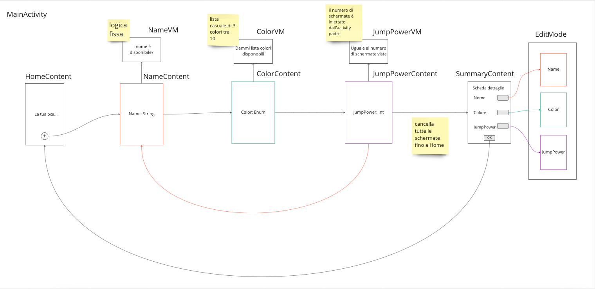

A silly sample project, to play with [Navigation for Compose](https://developer.android.com/jetpack/compose/navigation).

### Points to discuss
The good:
- single `NavHost` with the whole navigation picture
- `navController.popBackStack(route = routeId)`
- `NavOptions`
- `hiltViewModel()` + `backStackEntry.savedStateHandle`

The bad:
- custom `NavType<T>` to marshal/unmarshal

The ugly:
- `startDestination` with default param
- `backStackEntry.arguments`